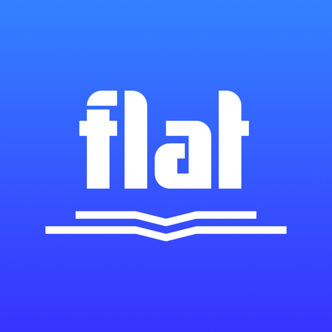
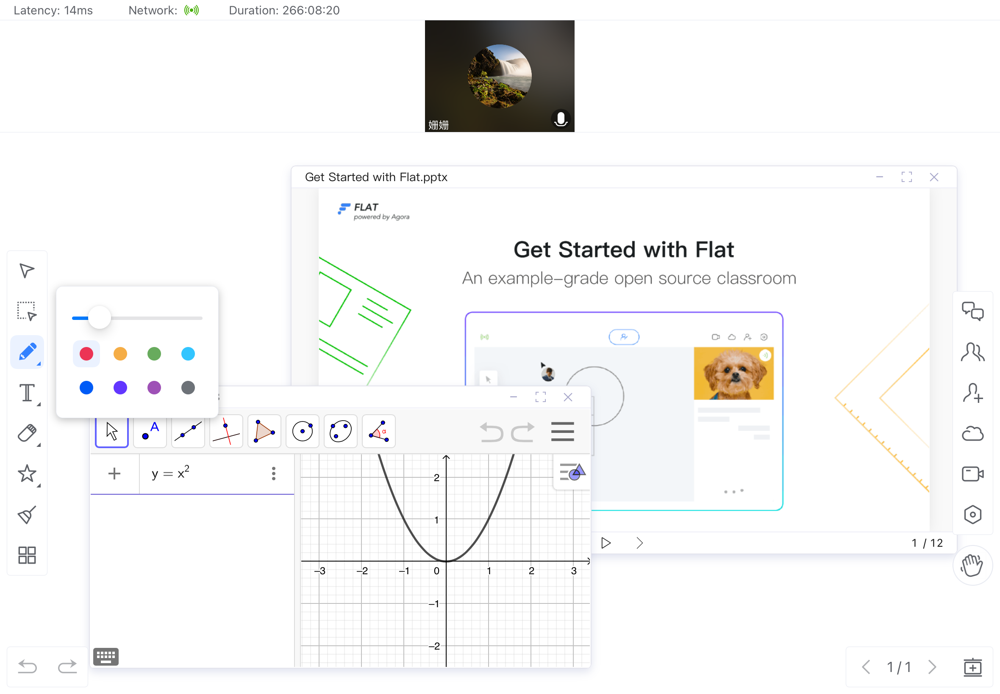

    

    
    
     
    
    

    <h1>Agora Flat iOS</h1>
    
Flat是 <a href="https://flat.whiteboard.agora.io/en/">Agora Flat</a> 开源教室的 iOS 客户端。

    
    
<a href="./README-zh.md">En</a>

# 特性

- 前后端完全开源
  - [X] [Flat Web][flat-web]
  - [X] Flat 桌面端 ([Windows][flat-homepage] and [macOS][flat-homepage])
  - [X] [Flat Android][flat-android]
  - [X] [Flat iOS][flat-iOS]
  - [X] [Flat Server 服务器][flat-server]
- 多场景课堂
  - [X] 大班课
  - [X] 小班课
  - [X] 一对一
- 实时交互
  - [X] 多功能互动白板
  - [X] 实时音视频（RTC）通讯
  - [X] 即时消息（RTM）聊天
  - [X] 举手上麦发言
- 帐户系统
  - [X] 微信登陆
  - [X] GitHub 登陆
- 房间管理
  - [X] 加入、创建
  - [X] 支持周期性房间
  - [X] 查看历史房间

- [X] 多媒体课件云盘
- [X] 屏幕共享

# 开发环境

## 环境配置

| iOS 最低版本 | Xcode版本 | Swift 版本 |
| ------------ | --------- | ---------- |
| 12.0         | 13.0      | Swift 5    |

### 安装

1. 安装 [CocoaPods](https://cocoapods.org)。
2. 在终端中进入Flat目录，执行 `pod install`.

### 配置签名

1. 用Xcode打开 `Flat.xcworkspace` 。
2. 在Xcode中前往编辑'Flat-DEV'这个Target的 [Signing &amp; Capabilities pane](https://developer.apple.com/documentation/xcode/adding_capabilities_to_your_app) 。
3. 切换到你的 `Team`。
4. 换一个不一样的 `Bundle identifier`。

### 运行

1. 选择Scheme Flat-DEV .
2. 按 ⌘R 启动 app.

# 免责声明

你可以将 Flat 用于商业用途但请注意我们不接受商业化需求定制与部署支持以及其它客户服务。如有相关需求请前往[灵动课堂][Flexible Classroom]。

本项目仅用于学习和交流使用，请遵守所在国的法律法规，切勿用于涉及政治、宗教、色情、犯罪等领域，一切违法后果请自负。

## 许可证

版权所有 Agora, Inc. 保留所有权利。

使用 [MIT 许可证](https://github.com/netless-io/flat/blob/main/LICENSE)

当使用 Flat 或其他 GitHub 徽标时，请务必遵循 [GitHub 徽标指南](https://github.com/logos)。

[flat-homepage]: https://flat.whiteboard.agora.io/en/#download
[flat-web]: https://flat-web.whiteboard.agora.io/
[flat-server]: https://github.com/netless-io/flat-server
[flat-android]: https://github.com/netless-io/flat-android
[flat-storybook]: https://netless-io.github.io/flat/storybook/
[open-wechat]: https://open.weixin.qq.com/
[netless-auth]: https://docs.agora.io/en/whiteboard/generate_whiteboard_token_at_app_server?platform=RESTful
[agora-app-id-auth]: https://docs.agora.io/en/Agora%20Platform/token#a-name--appidause-an-app-id-for-authentication
[cloud-recording]: https://docs.agora.io/en/cloud-recording/cloud_recording_api_rest?platform=RESTful#storageConfig
[cloud-recording-background]: https://docs.agora.io/en/cloud-recording/cloud_recording_layout?platform=RESTful#background
[electron-updater]: https://github.com/electron-userland/electron-builder/tree/master/packages/electron-updater
[Flexible Classroom]: https://www.agora.io/cn/agora-flexible-classroom
